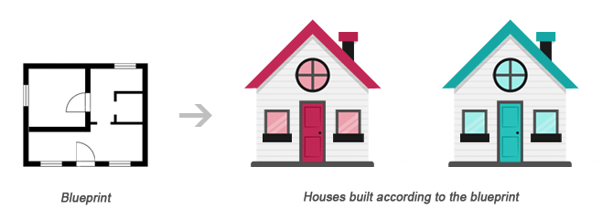
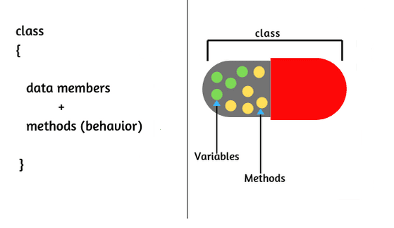

# Introducción a la Programación Orientada a Objetos
## 1 Programación Orientada a Objetos
La programación estructurada enfoca su resolución desde la división del problema en problemas cada vez más pequeños. Usamos funciones para colocar zonas especializadas de código o código que se usa constantemente en su interior.

El paradigma estructurado es correcto, pero tiene algunas limitaciones y algunos problemas cuando la solución es compleja.  Además su mantenibilidad es limitada y costosa. Generalmente, un cambio en una parte del programa produce cambios en otras partes que quizá no estén relacionadas directamente. En general, los programas estructurados son poco flexibles.

En la programación orientada a Objetos (OOP) el enfoque de resolución de problemas es diferente. En lugar de subdividirlos, lo que hará es ver cuáles son los componentes u Objetos que componen el problema y la forma cómo interactúan. Luego Ud. programará estos Objetos y la comunicación entre ellos. Cuando los Objetos hagan su labor y se comuniquen, el problema estará resuelto.

La Programación procedimental enfatiza en Algoritmos mientras que la OOP Enfatiza en los datos.

*La idea de la OOP es hacer una abstracción de la realidad para que la solución que Ud. diseñe sea lo más ad-hoc al problema de la vida real que se le plantea.*

entonces.. ¿Qué es un Objeto?

### 1.1 Objeto
La idea de la OOP es combinar en una Única Unidad tanto los datos (atributos) como las funciones (métodos) que operan sobre esos datos. Esta unidad es el Objeto.

Luego, podríamos definir Objeto como una Entidad individual que se caracteriza por tener:

| UN ESTADO Y UN COMPORTAMIENTO 	|
|-------------------------------	|


**Estado**: Son los valores que toman sus datos (atributos).


**Comportamiento**: Definido por la funcionalidad de la Clase que originará el Objeto (los métodos).

Para crear un Objeto debe:

1.- crear una *Clase*. 

2.- *Instanciar* la Clase que creó en el paso anterior.

Y, ¿Que es una Clase?

### 1.2 Clase 

Es la plantilla de donde se generan cuantos Objetos Ud. necesitará. Veálo como un plano que contiene las especificaciones de lo que será el Objeto. Piense en una casa. Para construir una casa primero define cuantos pisos, cuartos, ventanas etc. quiere. Luego dibuja el plano. El plano no es la casa. No podrá vivir ni actuar en él plano. Gracias al plano construirá la casa y en esta construcción sí podrá llevar a cabo sus actividades.




Lo mejor es que, ese plano le sirve para construir otra casa, y cuantas necesite.

El mismo razonamiento anterior, sirve para cualquier Objeto de la vida real, que luego Ud. llevará al ambito de la Programación.  


>Vea los Objetos que lo rodean. Todos tienen sus propiedades (color, tamaño, forma etc.) y su comportamiento (arranca, muestra, escribe etc.). Todos tienen sus atributos y métodos.  Este ejercicio mental, lo ayudará a ganar destreza diseñando sistemas.

En esencia, una Clase es un tipo de datos, así:

Es un tipo de dato que contiene **ATRIBUTOS Y MÉTODOS**

Entonces, ¿Cómo hacemos una Clase?

Para declarar Clases, el esquema es este:


```
class nombre:
    //atributos
    ..
    ..
    //métodos
    ..
    ..

```

**Los atributos** son la información con la que trabajará la Clase. La Clase *solo debe tener los datos necesarios para ejecutar su trabajo*. La declaración de los atributos de una Clase es similar a la declaración de variables pero especificando su forma de acceso.  Estos pueden ser: *público* y *privado*. 
Con los datos de acceso público cualquier elemento del exterior, como la función Main() o algún otro Objeto, puede acceder al dato, leerlo y modificarlo. 


**Los métodos** son las funciones que llevan a cabo el proceso o la lógica de la Clase. Análogo a los datos, Ud. debe definir su tipo de acceso. 

Los métodos trabajarán sobre los datos de la Clase. Es importante resaltar que **todos los métodos conocen todos los datos definidos dentro de la Clase, y pueden recibir parámetros y regresar valores**. A un atributo definido dentro de la Clase no necesitamos pasarlo como parámetro ya que el método lo conoce. **Tendrán acceso público únicamente los métodos que necesiten ser invocados desde el exterior**. Si el método sólo se invoca desde el interior de la Clase su acceso debe ser privado. Esto lo hacemos con fines de seguridad y para mantener el **encapsulamiento** correctamente.

Los métodos son el único medio para acceder a los atributos del Objeto. Es decir,

| los atributos deben estar ocultos 	|
|-----------------------------------	|


### 1.3 Protección de Datos y creación de Propiedades

Un problema de la Clase anterior 'electrodomestico', es que sus datos son públicos.  Para mantener la integridad de la OOP (Los métodos son el único medio para acceder a los datos del Objeto. Es decir, **los datos deben estar ocultos**.) es imperativo que Ud. administre el acceso a los atributos del Objeto; en esta sección definiremos y usaremos las 'Propiedades' para esto. 

Las Propiedades son una combinación de variable y método. Estos son: 'getters' y 'setters'.

- *get* se ejecuta cuando **se lee** la propiedad.  Si no se define la propiedad será de sólo escritura.
- *set* se ejecuta cuando **se asigna** un nuevo valor a la propiedad.  


### 1.4 Creación de la Instancia
Tener la Clase no es tener el Objeto, es necesario crear al menos una *instancia* de la Clase para tener el Objeto que, es quien finalmente tendrá los atributos y ejecutará los métodos que Ud. requiere para solucionar los problemas de programación planteados.
Para lograr la instanciación de una Clase la sintaxis es la siguiente:

```
obj =  Object(); 
```

Ud. puede en su desarrollo instanciar la Clase, las veces que considere necesario.  Cada instanciación resulta en un Objeto particular con sus propios atributos y métodos.


### 2.- Pilares de la OOP
## 2.1 Encapsulamiento

Es el proceso de agrupar los datos (atributos) y operaciones (métodos) de un Objeto bajo una misma unidad de programación (usualmente esta unidad de programación es la Clase), ocultar su funcionamiento y administrar el acceso a sus atributos. Para esto, Ud. definirá una especificación pública con la que se entenderán los clientes del Objeto, haciendo a estos, transparente su forma interna de operar.



Veamos el código:

```        
    #  getter
    def publicarPrecio(self):
        vResult = "El precio de", +self.marca + self.modelo + "es de:", self.__precio
        return vResult

    #  setter
    def actualizarPrecio(self, vNuevoPrecio):
        if vNuevoPrecio <= 0:
            print("prohibido regalar los electrodomesticos")
        else:
            self.__precio = vNuevoPrecio


```


## 2.2 Herencia
Las Clases pueden heredar entre si, lo que significa que una Clase recibe para si misma los datos (atributos) y el comportamiento (métodos) de una Clase superior.

```
class lavadora(electrodomestico):
    def enjuagar(self):
        pass
    
    def centrifugar(self):
        pass 
```

Declarar una clase junto a otra clase entre paréntesis indica que la Clase que estamos creando 'lavadora' hereda de la Clase 'eletrodomestico' sus atributos y métodos.

En este ejemplo, 'electrodomestico' será la Clase base o super Clase y 'lavadora' la subClase.  Otra forma de decirlo (y la que más usaremos) es:

lavadora *extiende* a electrodomestico.


## 2.3 Abstracción
Como en la vida real, la abstracción es ocuparse de los aspectos más importantes de un punto de vista determinado y no de otros. Es decir, la abstracción diferencia entre las propiedades externas de una unidad y los detalles internos de la misma.


Utilizando nuestro ejemplo del electrodomestico, Ud. estará familiarizado con sus características y su manejo manual.  Sabe como prenderlo, ajustarlo y detenerlo; Sin embargo, ¿sabe  cómo funciona internamente? Probablemente si, pero en primer termino **lo importante es que sabe usarlo**. Esta
característica se debe a que los electrodomesticos seguramente separan su implementación interna (el motor, el cableado, las e/s de agua etc.) de su interfaz externa (la perilla on/off, los botones, los reguladores etc.)

Abstracción es entonces, una técnica para reducir la complejidad.

En OOP, Abstracción significa concentrarse en: *¿qué es?* y *¿qué hace?* un Objeto y no en como debe implementarse.

Si algo es abstracto implica que no puede instanciarse pero que existe como idea y/o concepto. En Python 3 Ud. tiene a las clases abstractas; no se instancian pero sirven para crear clases base de las cuales se heredarán otras especializadas y específicas. 

Con nuestro caso de estudio, podemos convertir a la clase 'electrodomestico' en abstracta ya que 'lavadora','plancha','arrocera' etc. heredarán sus atributos y métodos y no necesitará instanciarla más.  

Para lograr esto, es necesario importar el módulo que provee la infraestructura que defina clases abtractas ABC (Abstract Base Classes ).

```
#!/usr/bin/python3
from abc import(ABC, abstractmethod)

class electrodomestico(ABC):
    # atributos de la clase
    marca = ""
    modelo = ""
    capacidad = ""
    potencia = ""
    __precio = 0

```

>La Clase base es la **generalización** de la Clase extendida y la Clase extendida es la **especialización** de la Clase base.

## 2.4 Polimorfismo

Es la propiedad de que un operador o una función actúen de forma distinta según el Objeto que se aplica. Sería:

| LAS DISTINTAS FORMAS DE HACER LO MISMO 	|
|----------------------------------------	|

En simples terminos el polimorfismo nos permite (que en tiempo de ejecución) los Objetos puedan responder a un mismo mensaje de diferentes maneras, dependiendo de como los «interroguemos».

En programación sería la capacidad que tiene una Clase en convertirse en un nuevo Objeto sin cambiar su esencia.  Esto quiere decir que tendremos el mismo método en ambas Clases, pero en la Clase hija realizará diferentes acciones. Por lo que el polimorfismo es también denominado sobreescritura de métodos.

Veámoslo con nuestro caso de estudio.  


```
def encender(self):
    print("Equipo listo para ser utilizado.")

```

Si instancia 'electrodomestico' la invocación del método 'prender' imprimirá en pantalla `Equipo listo para ser utilizado.`.

El mismo método en la subClase lavadora:

```
def encender(self):
    print("Se inicia encendido de la lavadora. Asegurese de tener agua")
```
Si instancia 'lavadora' la invocación del método 'prender' imprimirá en pantalla `Se inicia encendido de la lavadora. Asegurese de tener agua`.

### 3.- Ejercicios y Actividades Propuestas
- 3.1 Cree un nvo. proyecto de consola, cambie "Hello World!" por "Hola Progr2!°. Compile y ejecutelo.

- 3.2 Sobre el control de versiones:
Abra un cuenta en [GitHub](https://github.com/) o [GitLab](https://about.gitlab.com/). De preferencia asociela a la cta. de correo que tiene registrado en Prog. 2.   
Cree un repositorio nuevo, incluya un el resultado de 3.1 y un README.md y escriba alli algunos datos (su nombre y la carrera que estudia).
Envie la url del repositorio al correo de su Profesor.


